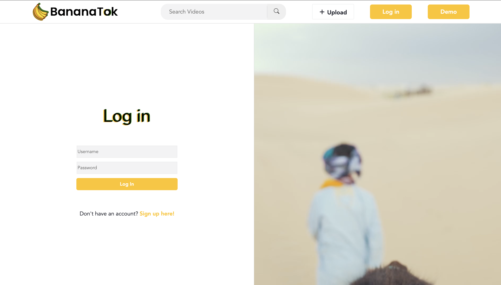
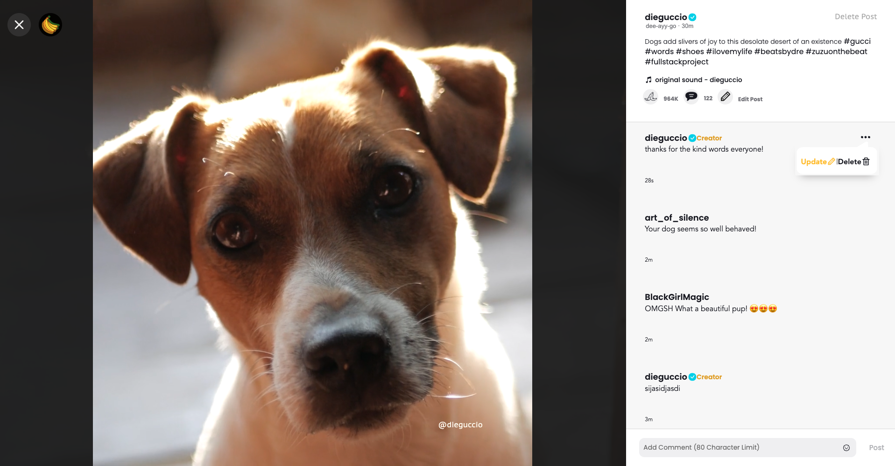
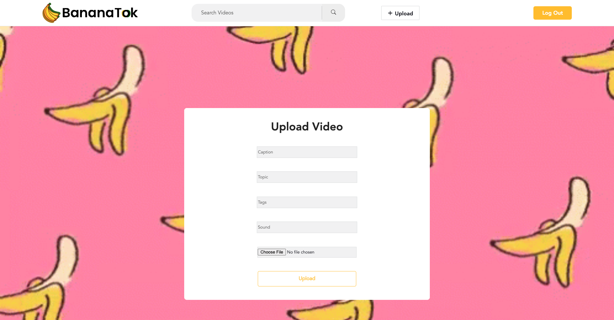

# README

# Table of Contents

### 1) Welcome
### 2) What is BananaTok?
### 3) Technology Stack
### 4) Features (with Screen Grabs)

&nbsp;  

# Welcome to the BananaTok README!

This README will outline the features, intent, and technology of BananaTok.

&nbsp;

# What is BananaTok?

[BananaTok](https://bananatok.herokuapp.com/) is a student project clone of the popular video social networking app: TikTok. It is not meant to be monetized and was purely designed as a demonstration of aptitude with the utilized technology stack. I chose to make a clone of TikTok because I found it to be a visually appealing app with commonly found social networking application features that I wanted to learn more about building (and breaking) from scratch. All in all I've had a great experience building this site and am proud of the work that I put into it. Feel free to contact me at jayreddy@gmail.com with any questions you may have while exploring the site's contents!

&nbsp;

# Technology Stack

- Frontend: JavaScript, React.js + Redux.js, HTML, CSS
- Backend: Ruby on Rails
- Additional: AWS S3, Heroku, Google Fonts

&nbsp;

# Features

1) Splash Page/Index:

True to TikTok's design, BananaTok features a Splash Page that shows videos and some details about said videos to an unregistered user:

&nbsp;

2) User Authentication:

BananaTok has the full User Authentication pattern (signup, login, demo login), limiting some of its features to users who create an account/login. Logged in users can see and populate comments on posts as well as upload, edit and delete their own posts:

&nbsp;

3) Creating, Reading, Updating, and Destroying Comments:

As mentioned above, users can comment on each other's (and their own) posts. Users can then edit or delete their own comments:

&nbsp;

4) Creating, Reading, Updating, and Destroying Posts:

Users can upload their own posts after creating an account/logging in. They can then edit/delete their own posts:

&nbsp;

5) Filter Videos by Topic:

Users can filter out videos on the Splash Page based off their topic of choice:

